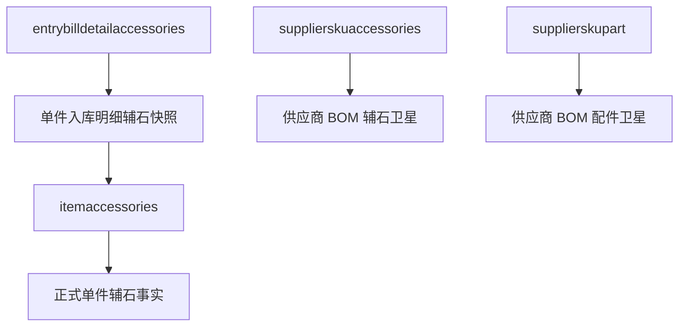

# 辅石与配件卫星层能力图

```mermaid
flowchart TD
    A["entrybilldetailaccessories"] --> A1["单件入库明细辅石快照"]
    A1 --> B["itemaccessories"]
    B --> B1["正式单件辅石事实"]
    C["supplierskuaccessories"] --> C1["供应商 BOM 辅石卫星"]
    D["supplierskupart"] --> D1["供应商 BOM 配件卫星"]
```
