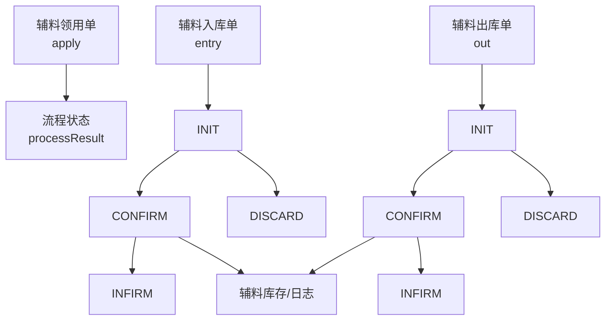

# 配件执行链状态图

```mermaid
flowchart TD
    A["辅料领用单<br/>apply"] --> A1["流程状态<br/>processResult"]
    B["辅料入库单<br/>entry"] --> B1["INIT"]
    B1 --> B2["CONFIRM"]
    B2 --> B3["INFIRM"]
    B1 --> B4["DISCARD"]
    C["辅料出库单<br/>out"] --> C1["INIT"]
    C1 --> C2["CONFIRM"]
    C2 --> C3["INFIRM"]
    C1 --> C4["DISCARD"]
    B2 --> D["辅料库存/日志"]
    C2 --> D
```
