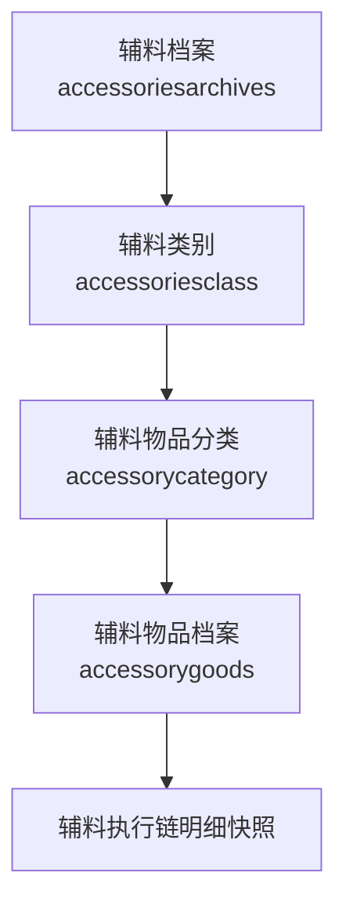

# 配件主数据状态图

```mermaid
flowchart TD
    A["辅料档案<br/>accessoriesarchives"] --> B["辅料类别<br/>accessoriesclass"]
    B --> C["辅料物品分类<br/>accessorycategory"]
    C --> D["辅料物品档案<br/>accessorygoods"]
    D --> E["辅料执行链明细快照"]
```
