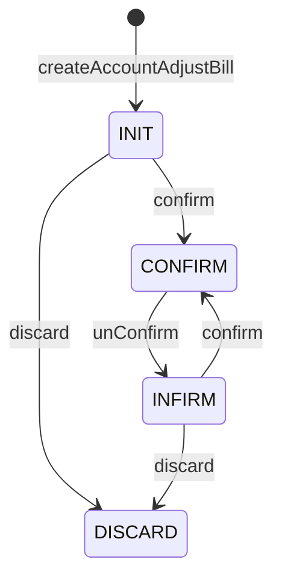

# 调账单状态机图
> 来源：`AccountAdjustBillServiceImpl`

```mermaid
stateDiagram-v2
    [*] --> INIT: createAccountAdjustBill

    INIT --> CONFIRM: confirm
    INFIRM --> CONFIRM: confirm

    CONFIRM --> INFIRM: unConfirm

    INIT --> DISCARD: discard
    INFIRM --> DISCARD: discard
```

## 说明
- `confirm` 代码层面只显式拦“已审不能重复审核”，未统一收敛可审核状态。
- `discard` 代码层面只禁止 `CONFIRM`，对其他异常状态是否允许作废仍需业务确认。
- 调账单没有 BPM 状态图分支，审核/反审直接由业务接口驱动。
