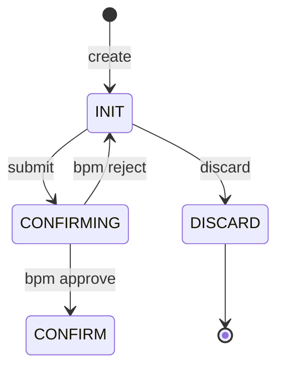

# 单件调整单状态机图

```mermaid
stateDiagram-v2
    [*] --> INIT : create
    INIT --> CONFIRMING : submit
    INIT --> DISCARD : discard
    CONFIRMING --> CONFIRM : bpm approve
    CONFIRMING --> INIT : bpm reject
    DISCARD --> [*]
```

## 说明
1. 这个模块当前仍然真实接入 BPM，`submit()` 会进入 `CONFIRMING`。
2. 审批通过后才真正改单件、库存和维修链。
3. 审批拒绝不会保留“处理中”状态，而是把单头回到 `INIT`。
