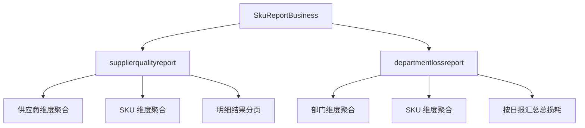

# 分析报表尾项能力图

```mermaid
flowchart TD
    A["supplierqualityreport"] --> A1["供应商维度聚合"]
    A --> A2["SKU 维度聚合"]
    A --> A3["明细结果分页"]
    B["departmentlossreport"] --> B1["部门维度聚合"]
    B --> B2["SKU 维度聚合"]
    B --> B3["按日报汇总总损耗"]
    C["SkuReportBusiness"] --> A
    C --> B
```
