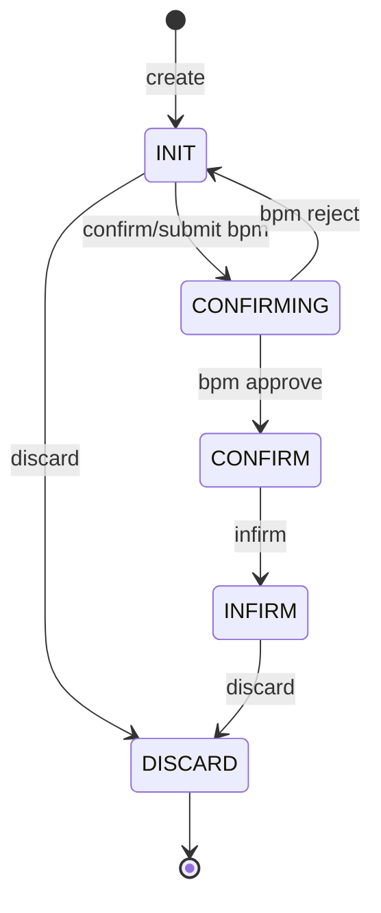

# 单件作废单状态机图

```mermaid
stateDiagram-v2
    [*] --> INIT : create
    INIT --> CONFIRMING : confirm/submit bpm
    INIT --> DISCARD : discard
    CONFIRMING --> CONFIRM : bpm approve
    CONFIRMING --> INIT : bpm reject
    CONFIRM --> INFIRM : infirm
    INFIRM --> DISCARD : discard
    DISCARD --> [*]
```

## 说明
1. 这个模块当前也真实接入 BPM，`confirm()` 实际是提交流程。
2. 审批通过后，单件状态会从 `ON_WARE` 改成 `DISCARD`。
3. 反审会把单件状态恢复到 `ON_WARE`，并把库存整条回滚。
