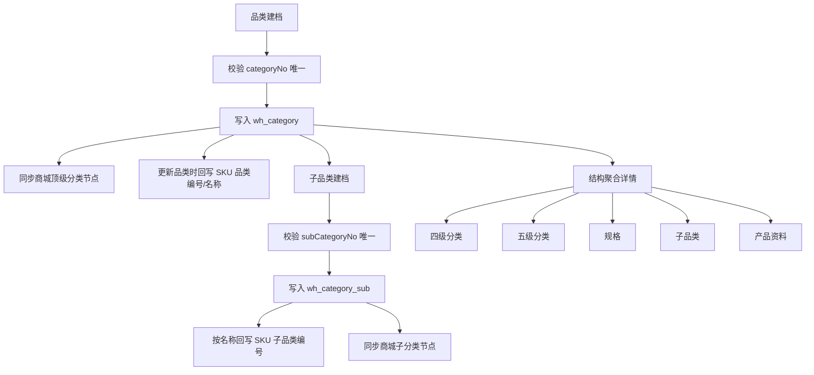

# 品类结构能力图

```mermaid
flowchart TD
    A["品类建档"] --> B["校验 categoryNo 唯一"]
    B --> C["写入 wh_category"]
    C --> D["同步商城顶级分类节点"]
    C --> E["更新品类时回写 SKU 品类编号/名称"]

    C --> F["子品类建档"]
    F --> G["校验 subCategoryNo 唯一"]
    G --> H["写入 wh_category_sub"]
    H --> I["按名称回写 SKU 子品类编号"]
    H --> J["同步商城子分类节点"]

    C --> K["结构聚合详情"]
    K --> L["四级分类"]
    K --> M["五级分类"]
    K --> N["规格"]
    K --> O["子品类"]
    K --> P["产品资料"]
```
