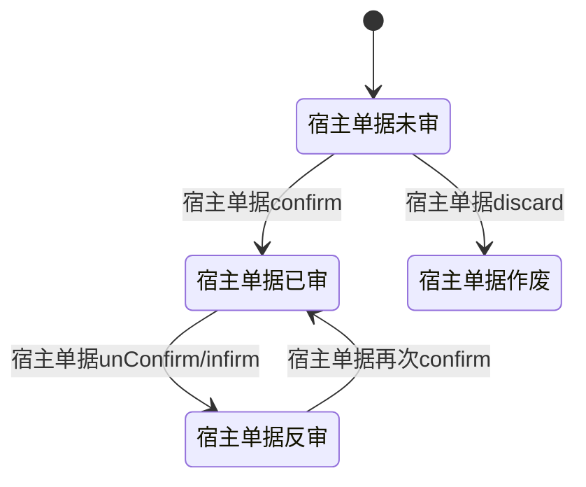

# 结价单状态依附图
> 结价没有独立主单据状态机，只依附宿主单据推进

```mermaid
stateDiagram-v2
    [*] --> 宿主单据未审
    宿主单据未审 --> 宿主单据已审: 宿主单据confirm
    宿主单据已审 --> 宿主单据反审: 宿主单据unConfirm/infirm
    宿主单据未审 --> 宿主单据作废: 宿主单据discard
    宿主单据反审 --> 宿主单据已审: 宿主单据再次confirm
```

## 说明
- 结价本身没有独立 `bill_status`。
- 结价的创建、修改、删除都跟着宿主单据结算明细走。
- 结价的审核生效点就是宿主单据的审核点。
