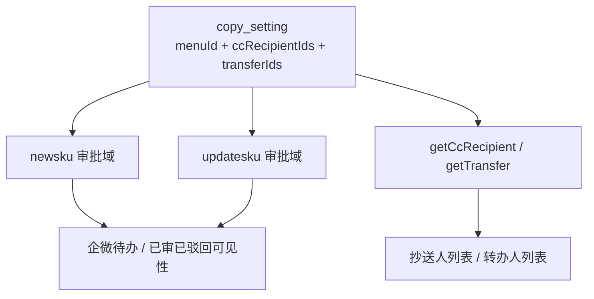

# 抄送配置状态图

```mermaid
flowchart TD
    A["copy_setting<br/>menuId + ccRecipientIds + transferIds"] --> B["newsku 审批域"]
    A --> C["updatesku 审批域"]
    B --> D["企微待办 / 已审已驳回可见性"]
    C --> D
    A --> E["getCcRecipient / getTransfer"]
    E --> F["抄送人列表 / 转办人列表"]
```
