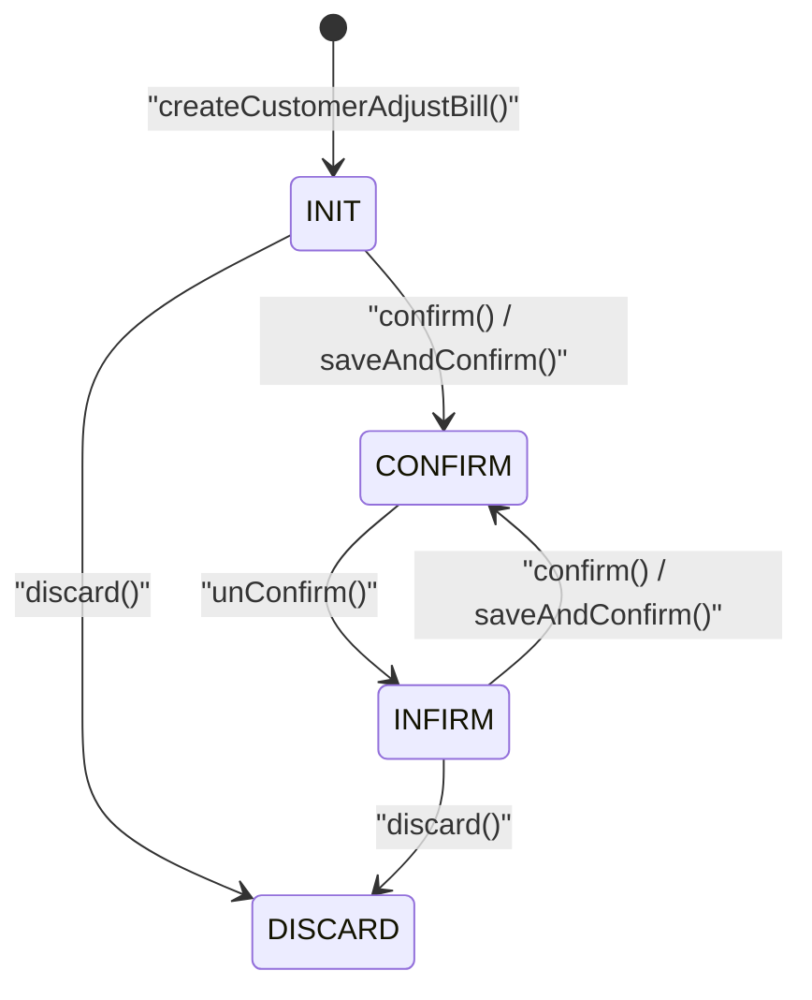

# 客户应收账调整状态机图
> 基于 commit: `48af575a1314636c88e9f05ca3cb4443f88865bd`，日期：2026-03-31

## 说明
- 客户应收账调整沿用标准 `BillStatusEnum`。
- 审核/反审只驱动钱包动账，不涉及银行卡。
- 提供 `saveAndConfirm()` 复合入口，但最终仍走同一套状态迁移。

## Mermaid

## 关键迁移说明
1. `updateCustomerAdjustBill()` 仅允许 `INIT/INFIRM` 修改。
2. `confirm()` 审核时会按明细逐条调整客户钱包。
3. `unConfirm()` 会把钱包影响逐条冲回，并进入 `INFIRM`。
4. `saveAndConfirm()` 只是“创建或更新 + confirm”的组合入口。

## 关键前置条件
| 动作 | 关键前置条件 |
|------|-------------|
| `updateCustomerAdjustBill` | 当前状态必须是 `INIT` 或 `INFIRM` |
| `confirm` | 当前状态不能已经是 `CONFIRM` |
| `unConfirm` | 当前状态必须是 `CONFIRM`，跨日还要具备 `CUSTOMER_ADJUST_BILL_CROSS_DAYS` 权限 |
| `discard` | 当前状态必须满足 `BillStatusEnum.validDiscard()` |

## 逻辑可疑
| 标记 | 方法 | 摘要 |
|------|------|------|
| ⚠️ | `confirm` | 只拦重复审核，未显式拦截 `DISCARD` 等异常状态再次审核 |
| ⚠️ | `deleteCustomerAdjustBill` | 删除动作未体现状态校验，理论上已审核单据也可能被直接删除 |
