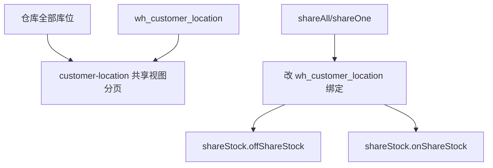

# 客户共享库位能力图

```mermaid
flowchart TD
    A["仓库全部库位"] --> B["customer-location 共享视图分页"]
    C["wh_customer_location"] --> B

    D["shareAll/shareOne"] --> E["改 wh_customer_location 绑定"]
    E --> F["shareStock.offShareStock"]
    E --> G["shareStock.onShareStock"]
```
