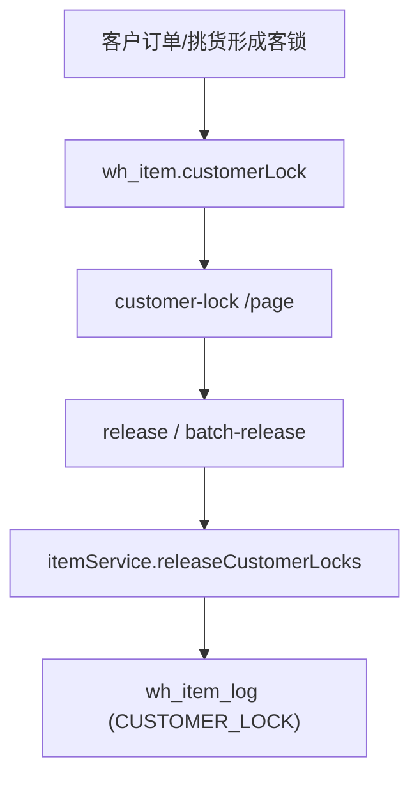

# 客锁管理能力图

```mermaid
flowchart TD
    A["客户订单/挑货形成客锁"] --> B["wh_item.customerLock"]
    B --> C["customer-lock /page"]
    C --> D["release / batch-release"]
    D --> E["itemService.releaseCustomerLocks"]
    E --> F["wh_item_log (CUSTOMER_LOCK)"]
```
