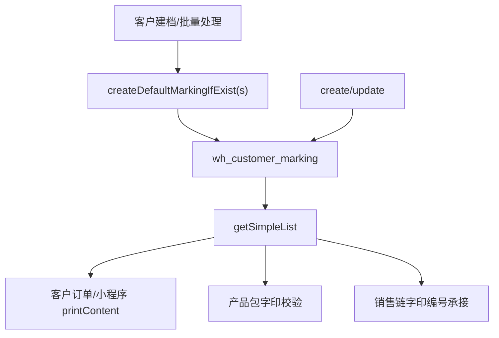

# 客户字印能力图

```mermaid
flowchart TD
    A["客户建档/批量处理"] --> B["createDefaultMarkingIfExist(s)"]
    B --> C["wh_customer_marking"]

    D["create/update"] --> C
    C --> E["getSimpleList"]
    E --> F["客户订单/小程序 printContent"]
    E --> G["产品包字印校验"]
    E --> H["销售链字印编号承接"]
```
