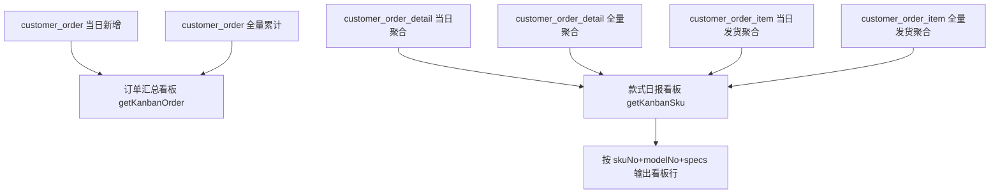

# 客户订单看板能力图

```mermaid
flowchart TD
    A["customer_order 当日新增"] --> B["订单汇总看板 getKanbanOrder"]
    C["customer_order 全量累计"] --> B

    D["customer_order_detail 当日聚合"] --> E["款式日报看板 getKanbanSku"]
    F["customer_order_detail 全量聚合"] --> E
    G["customer_order_item 当日发货聚合"] --> E
    H["customer_order_item 全量发货聚合"] --> E
    E --> I["按 skuNo+modelNo+specs 输出看板行"]
```
