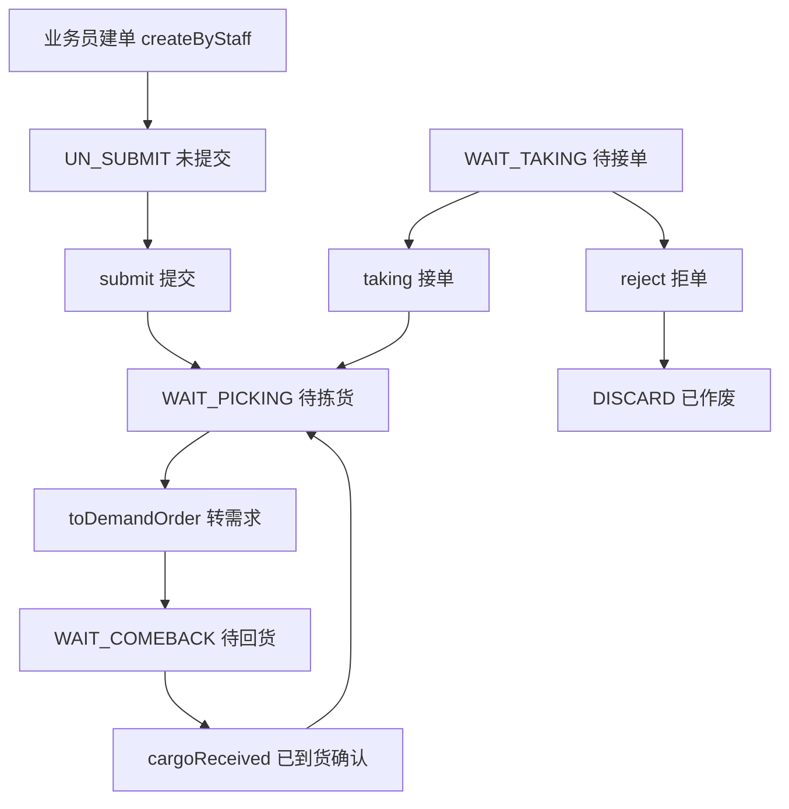

# 客户订单接单状态图

```mermaid
flowchart TD
    A["业务员建单 createByStaff"] --> B["UN_SUBMIT 未提交"]
    B --> C["submit 提交"]
    C --> D["WAIT_PICKING 待拣货"]
    E["WAIT_TAKING 待接单"] --> F["taking 接单"]
    F --> D
    E --> G["reject 拒单"]
    G --> H["DISCARD 已作废"]
    D --> I["toDemandOrder 转需求"]
    I --> J["WAIT_COMEBACK 待回货"]
    J --> K["cargoReceived 已到货确认"]
    K --> D
```
