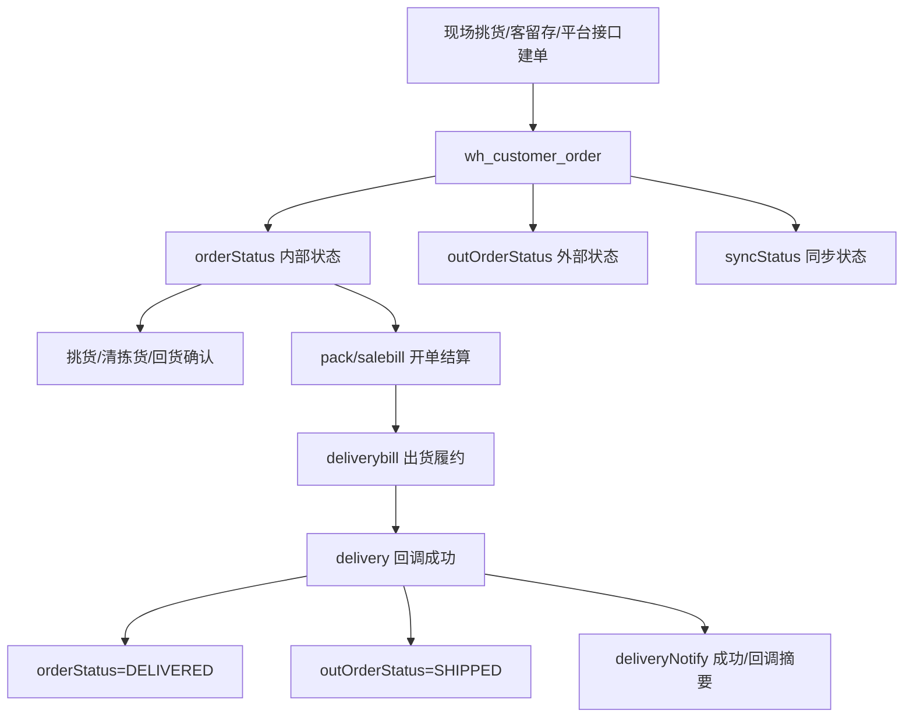

# 客户订单状态图

```mermaid
flowchart TD
    A["现场挑货/客留存/平台接口建单"] --> B["wh_customer_order"]
    B --> C["orderStatus 内部状态"]
    B --> D["outOrderStatus 外部状态"]
    B --> E["syncStatus 同步状态"]

    C --> F["挑货/清拣货/回货确认"]
    C --> G["pack/salebill 开单结算"]
    G --> H["deliverybill 出货履约"]
    H --> I["delivery 回调成功"]
    I --> J["orderStatus=DELIVERED"]
    I --> K["outOrderStatus=SHIPPED"]
    I --> L["deliveryNotify 成功/回调摘要"]
```
