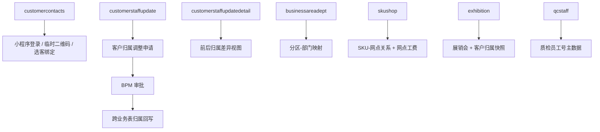

# 客户与组织尾项能力图

```mermaid
flowchart TD
    A["customercontacts"] --> A1["小程序登录 / 临时二维码 / 选客绑定"]
    B["customerstaffupdate"] --> B1["客户归属调整申请"]
    B1 --> B2["BPM 审批"]
    B2 --> B3["跨业务表归属回写"]
    C["customerstaffupdatedetail"] --> C1["前后归属差异视图"]
    D["businessareadept"] --> D1["分区-部门映射"]
    E["skushop"] --> E1["SKU-网点关系 + 网点工费"]
    F["exhibition"] --> F1["展销会 + 客户归属快照"]
    G["qcstaff"] --> G1["质检员工号主数据"]
```
