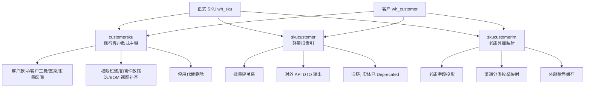

# 客户侧 SKU 关系域状态图

```mermaid
flowchart TD
    A["正式 SKU wh_sku"] --> B["customersku<br/>现行客户款式主链"]
    A --> C["skucustomer<br/>轻量旧索引"]
    A --> D["skucustomerlm<br/>老庙外部映射"]
    E["客户 wh_customer"] --> B
    E --> C
    E --> D

    B --> B1["客户款号/客户工费/直采/重量区间"]
    B --> B2["权限过滤/销售件数筛选/BOM 视图补齐"]
    B --> B3["停用代替删除"]

    C --> C1["批量建关系"]
    C --> C2["对外 API DTO 输出"]
    C --> C3["旧链, 实体已 Deprecated"]

    D --> D1["老庙字段投影"]
    D --> D2["渠道分类枚举映射"]
    D --> D3["外部款号缓存"]
```
