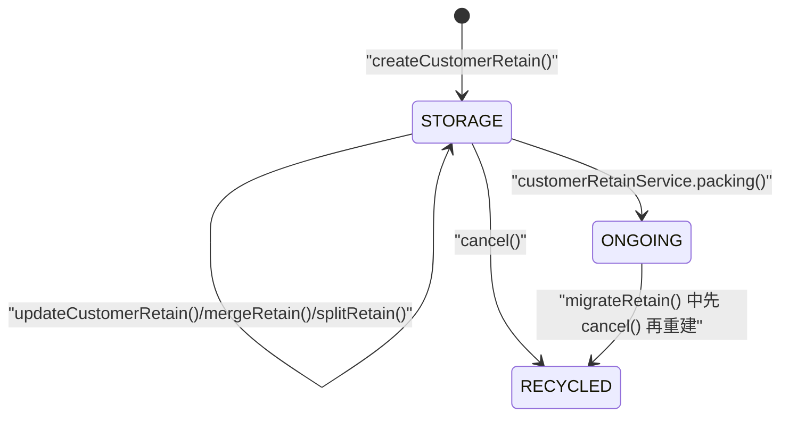
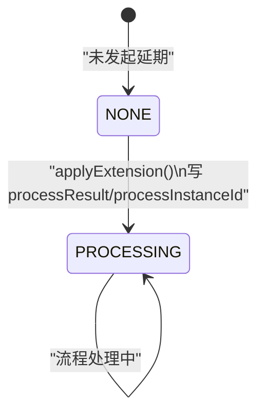

# 客留存状态机图
> 基于 commit: `48af575a1314636c88e9f05ca3cb4443f88865bd`，日期：2026-03-31

## 说明
- `wh_customer_retain.status` 当前已从代码证据中确认出至少两类主状态：
  - `STORAGE`：留存中
  - `ONGOING`：处理中/已被产品包占用
  - `RECYCLED`：取消留存后结束
- 客留存还存在一组独立的流程字段：
  - `processResult`
  - `processInstanceId`
  - `applyExpireTime`
- 后续修改时必须把“主状态”和“延期审批流程状态”分开看。

## 客留存主状态机

## 延期审批字段流

## 关键迁移说明

### 主状态 `status`
1. `createCustomerRetain()` 新建后进入 `STORAGE`。
2. `updateCustomerRetain()`、`mergeRetain()`、`splitRetain()` 都要求当前状态仍是 `STORAGE`，本身不推进到新状态。
3. `customerRetainService.packing()` 在产品包创建时要求：
   - 打包件数必须等于客留存件数
   - 打包金重必须等于客留存金重
   - 随后写入 `pack_no`
   - 并将 `status: STORAGE -> ONGOING`
4. `cancel()` 会把 `status: STORAGE -> RECYCLED`，并写 `end_time/day_count`。
5. `migrateRetain()` 的“新建迁移”分支会先对原客留存执行 `cancel()`，再新建一张新的 `STORAGE` 客留存。

### 延期流程字段
1. `applyExtension()` 不直接改主状态。
2. 它会写入：
   - `process_result`
   - `process_instance_id`
   - `process_user_id`
   - `apply_expire_time`
3. 这表示“延期审批处理中”，但不等价于主状态变更。

## 关键前置条件
| 动作 | 关键前置条件 |
|------|-------------|
| `updateCustomerRetain` | 客留存必须存在且 `status = STORAGE` |
| `cancel` | 客留存必须存在且 `status = STORAGE` |
| `mergeRetain` | 所有客留存必须 `status = STORAGE`，且同客户/同仓/同天/同大类/同材质/同业务类型 |
| `splitRetain` | 原客留存必须 `status = STORAGE` |
| `migrateRetain` | 原客留存必须 `status = STORAGE` |
| `applyExtension` | 状态必须属于 `RetainStatusEnum.useful()` |
| `packing` | 打包件数和金重必须与客留存完全一致 |

## 与上下游实体的联动
1. 创建、修改、合并、拆分、迁移时：
   - 联动客户订单主表
   - 联动订单明细和订单款式汇总
   - 可能锁定/解锁 EPC
2. 打包时：
   - 写 `pack_no`
   - 推进到 `ONGOING`
3. 取消时：
   - 解锁 EPC
   - 清空相关订单明细
   - 回退维修柜台数量

## 逻辑可疑
| 标记 | 方法 | 摘要 | 处理建议 |
|------|------|------|----------|
| ⚠️ | `cancel` | 文案写“重新上柜”，但实现把状态改成 `RECYCLED` | 确认 `RECYCLED` 是否就是上柜后的业务完成态 |
| ⚠️ | `migrateRetain` | 迁移分支里直接修改 `loginUser.wareIds` 放宽仓库权限 | 确认是否允许运行时修改登录上下文 |

## 使用建议
- 后续 AI 若修改客留存状态或延期规则，至少同步检查：
  - [customerretain.md](/D:/ws/code/wms-api/docs/business/customerretain.md)
  - [pack.md](/D:/ws/code/wms-api/docs/business/pack.md)
  - [customerorder.md](/D:/ws/code/wms-api/docs/business/customerorder.md)
