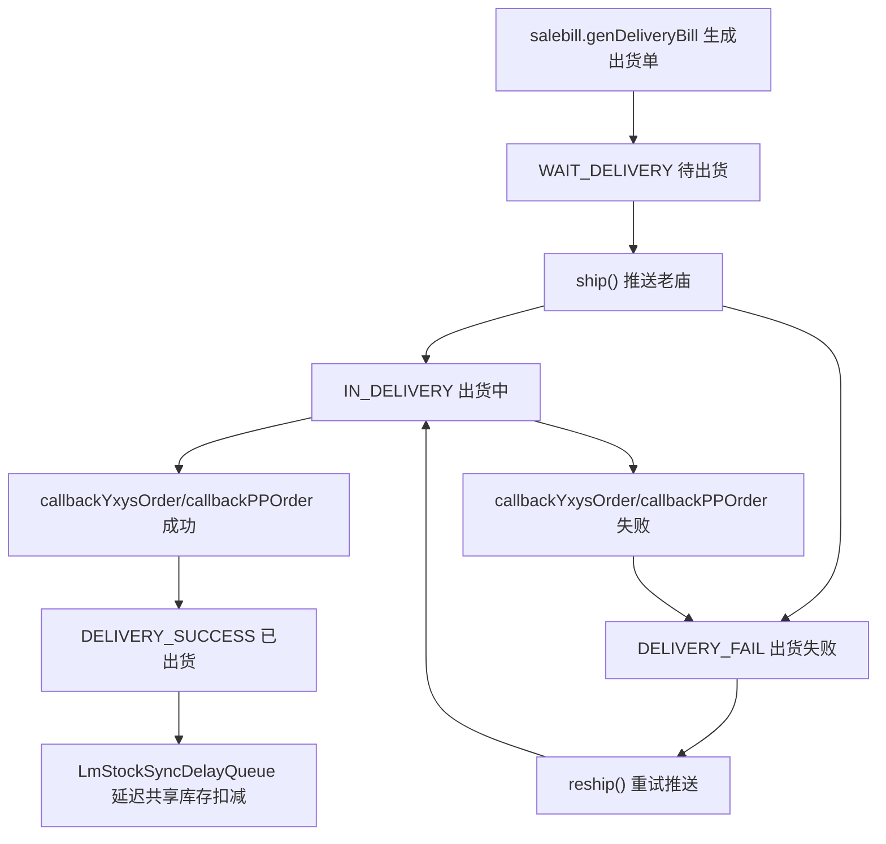

# 出货单状态图

```mermaid
flowchart TD
    A["salebill.genDeliveryBill 生成出货单"] --> B["WAIT_DELIVERY 待出货"]
    B --> C["ship() 推送老庙"]
    C --> D["IN_DELIVERY 出货中"]
    C --> E["DELIVERY_FAIL 出货失败"]
    E --> F["reship() 重试推送"]
    F --> D
    D --> G["callbackYxysOrder/callbackPPOrder 成功"]
    D --> H["callbackYxysOrder/callbackPPOrder 失败"]
    G --> I["DELIVERY_SUCCESS 已出货"]
    H --> E
    I --> J["LmStockSyncDelayQueue 延迟共享库存扣减"]
```
