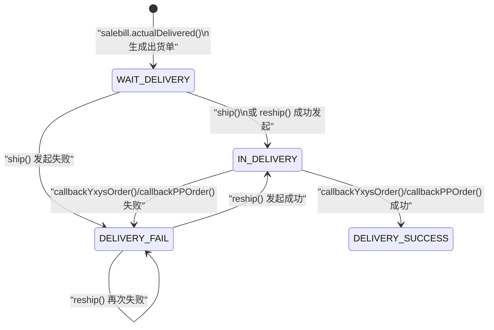

# 出货单状态机图
> 基于 commit: `48af575a1314636c88e9f05ca3cb4443f88865bd`，日期：2026-03-31

## 说明
- `wh_delivery_bill.status` 主要描述“对外发货同步进度”，不是本地库存状态。
- `ship()/reship()` 只表示请求已发起或失败，不等于最终发货成功。
- 真正的成功/失败终态要以异步回调为准。

## 出货单状态机

## 关键迁移说明
1. `salebill.actualDelivered()` 生成出货单后，出货单进入 `WAIT_DELIVERY`。
2. `ship()` 要求当前状态必须是 `WAIT_DELIVERY`：
   - 外部请求返回成功：`WAIT_DELIVERY -> IN_DELIVERY`
   - 外部请求返回失败：`WAIT_DELIVERY -> DELIVERY_FAIL`
3. `reship()` 要求当前状态必须是 `DELIVERY_FAIL`：
   - 重试成功：`DELIVERY_FAIL -> IN_DELIVERY`
   - 重试失败：保持 `DELIVERY_FAIL`
4. 回调成功时：
   - `wh_delivery_bill.status -> DELIVERY_SUCCESS`
   - `wh_customer_order.order_status -> DELIVERED`
   - `wh_customer_order.out_order_status -> SHIPPED`
5. 回调失败时：
   - `wh_delivery_bill.status -> DELIVERY_FAIL`
   - `wh_customer_order.out_order_status -> DELIVERY_FAIL`

## 关键前置条件
| 动作 | 关键前置条件 |
|------|-------------|
| `ship` | 出货单存在，且 `status = WAIT_DELIVERY`；`TYPE_B` 外单要求 `trackingNo` 非空 |
| `reship` | 出货单存在，且 `status = DELIVERY_FAIL`；`TYPE_B` 外单要求 `trackingNo` 非空 |
| 回调处理 | 依赖外部系统回传流水/业务单据匹配 |

## 与上下游实体的联动
1. 发起请求时：
   - 可能把 `trackingNo` 回写到客户订单 `outPpOrderNo`
   - 写入 `lm_api_transfer` 接口流水
2. 回调成功时：
   - 推进客户订单 `order_status -> DELIVERED`
   - 推进客户订单 `out_order_status -> SHIPPED`
3. 回调失败时：
   - 客户订单 `out_order_status -> DELIVERY_FAIL`

## 使用建议
- 后续 AI 若修改出货状态流，至少同步检查：
  - [deliverybill.md](/D:/ws/code/wms-api/docs/business/deliverybill.md)
  - [salebill.md](/D:/ws/code/wms-api/docs/business/salebill.md)
  - [customerorder.md](/D:/ws/code/wms-api/docs/business/customerorder.md)
