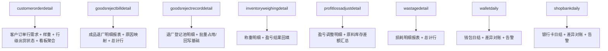

# 明细事实层与资金日结卫星能力图

```mermaid
flowchart TD
    A["customerorderdetail"] --> B["客户订单行需求 + 样重 + 行级出货状态 + 看板聚合"]
    C["goodsrejectbilldetail"] --> D["成品退厂明细报表 + 原因映射 + 总计行"]
    E["goodsrejectrecorddetail"] --> F["退厂登记池明细 + 批量占用/回写基础"]
    G["inventoryweighingdetail"] --> H["称重明细 + 盈亏结果回填"]
    I["profitlossadjustdetail"] --> J["盈亏调整明细 + 原料库存差额汇总"]
    K["wastagedetail"] --> L["损耗明细报表 + 总计行"]
    M["walletdaily"] --> N["钱包日结 + 差异对账 + 告警"]
    O["shopbankdaily"] --> P["银行卡日结 + 差异对账 + 告警"]
```
