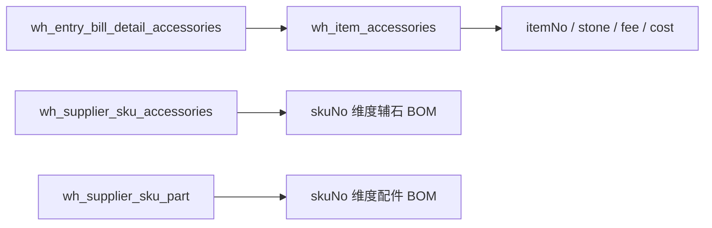

# 辅石与配件卫星层实体图

```mermaid
flowchart LR
    A["wh_entry_bill_detail_accessories"] --> B["wh_item_accessories"]
    B --> B1["itemNo / stone / fee / cost"]
    C["wh_supplier_sku_accessories"] --> C1["skuNo 维度辅石 BOM"]
    D["wh_supplier_sku_part"] --> D1["skuNo 维度配件 BOM"]
```
