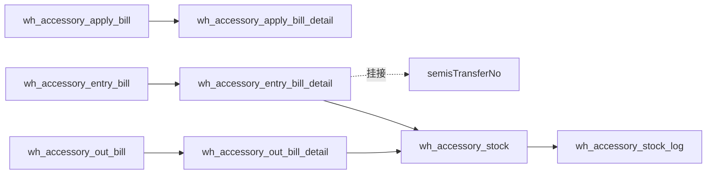

# 配件执行链实体图

```mermaid
flowchart LR
    A["wh_accessory_apply_bill"] --> B["wh_accessory_apply_bill_detail"]
    C["wh_accessory_entry_bill"] --> D["wh_accessory_entry_bill_detail"]
    E["wh_accessory_out_bill"] --> F["wh_accessory_out_bill_detail"]
    D -. "挂接" .-> G["semisTransferNo"]
    D --> H["wh_accessory_stock"]
    F --> H
    H --> I["wh_accessory_stock_log"]
```
