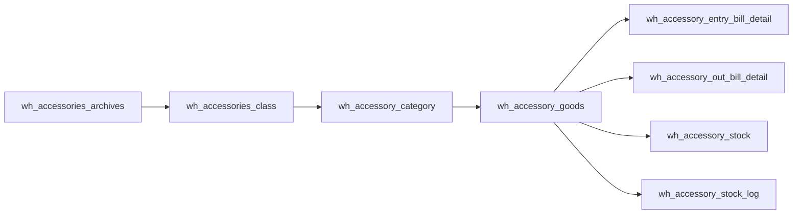

# 配件主数据实体链

```mermaid
flowchart LR
    A["wh_accessories_archives"] --> B["wh_accessories_class"]
    B --> C["wh_accessory_category"]
    C --> D["wh_accessory_goods"]
    D --> E["wh_accessory_entry_bill_detail"]
    D --> F["wh_accessory_out_bill_detail"]
    D --> G["wh_accessory_stock"]
    D --> H["wh_accessory_stock_log"]
```
