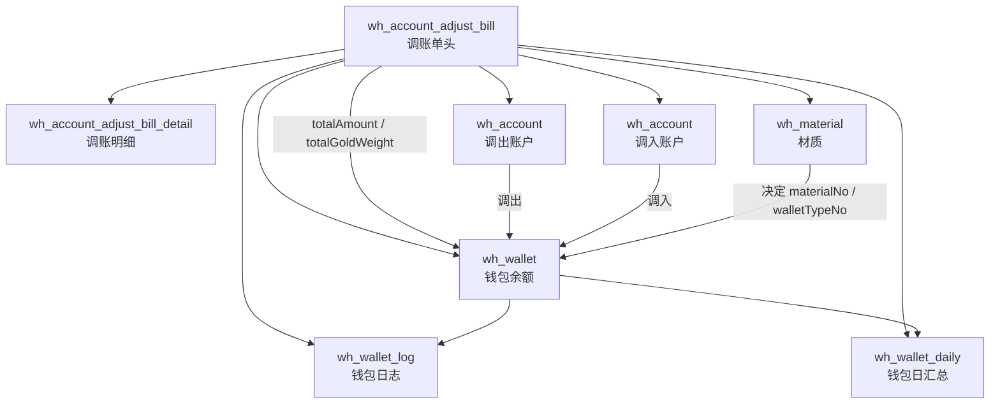

# 调账单实体关系图
> 核心关注：调账单如何把金额与金重在调出账户、调入账户之间成对过账

```mermaid
graph TD
    A["wh_account_adjust_bill\n调账单头"] --> B["wh_account_adjust_bill_detail\n调账明细"]
    A --> C["wh_account\n调出账户"]
    A --> D["wh_account\n调入账户"]
    A --> E["wh_material\n材质"]
    A --> F["wh_wallet\n钱包余额"]
    A --> G["wh_wallet_log\n钱包日志"]
    A --> H["wh_wallet_daily\n钱包日汇总"]

    A -- "totalAmount / totalGoldWeight" --> F
    C -- "调出" --> F
    D -- "调入" --> F
    E -- "决定 materialNo / walletTypeNo" --> F
    F --> G
    F --> H
```

## 关系说明
- 调账单真正驱动动账的是单头汇总值，不是逐条明细逐笔入账。
- 金额链固定走现金钱包，方向为“调出负、调入正”。
- 金重链按材质钱包走，方向同样是“调出负、调入正”。
- 反审时四笔动作整体反向回滚。
