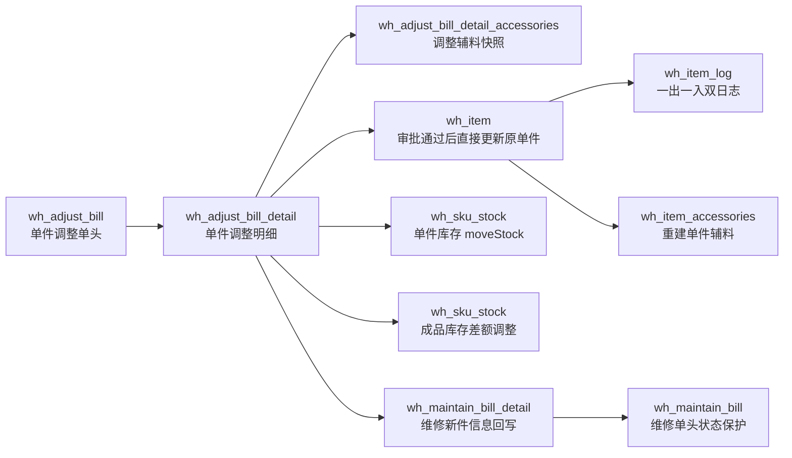

# 单件调整单实体图

```mermaid
flowchart LR
    A["wh_adjust_bill\n单件调整单头"] --> B["wh_adjust_bill_detail\n单件调整明细"]
    B --> C["wh_adjust_bill_detail_accessories\n调整辅料快照"]
    B --> D["wh_item\n审批通过后直接更新原单件"]
    D --> E["wh_item_log\n一出一入双日志"]
    D --> F["wh_item_accessories\n重建单件辅料"]
    B --> G["wh_sku_stock\n单件库存 moveStock"]
    B --> H["wh_sku_stock\n成品库存差额调整"]
    B --> I["wh_maintain_bill_detail\n维修新件信息回写"]
    I --> J["wh_maintain_bill\n维修单头状态保护"]
```

## 说明
1. 单件调整单不会新建单件，而是直接覆盖更新已有 `wh_item`。
2. 库存侧同时存在“单件库存旧出新入”和“成品库存按重量差额补扣”两条链。
3. 若挂维修链，调整后的单件信息会直接成为维修明细里的新件口径。
