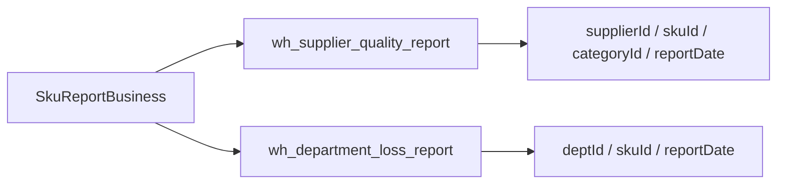

# 分析报表尾项实体图

```mermaid
flowchart LR
    A["SkuReportBusiness"] --> B["wh_supplier_quality_report"]
    A --> C["wh_department_loss_report"]
    B --> B1["supplierId / skuId / categoryId / reportDate"]
    C --> C1["deptId / skuId / reportDate"]
```
