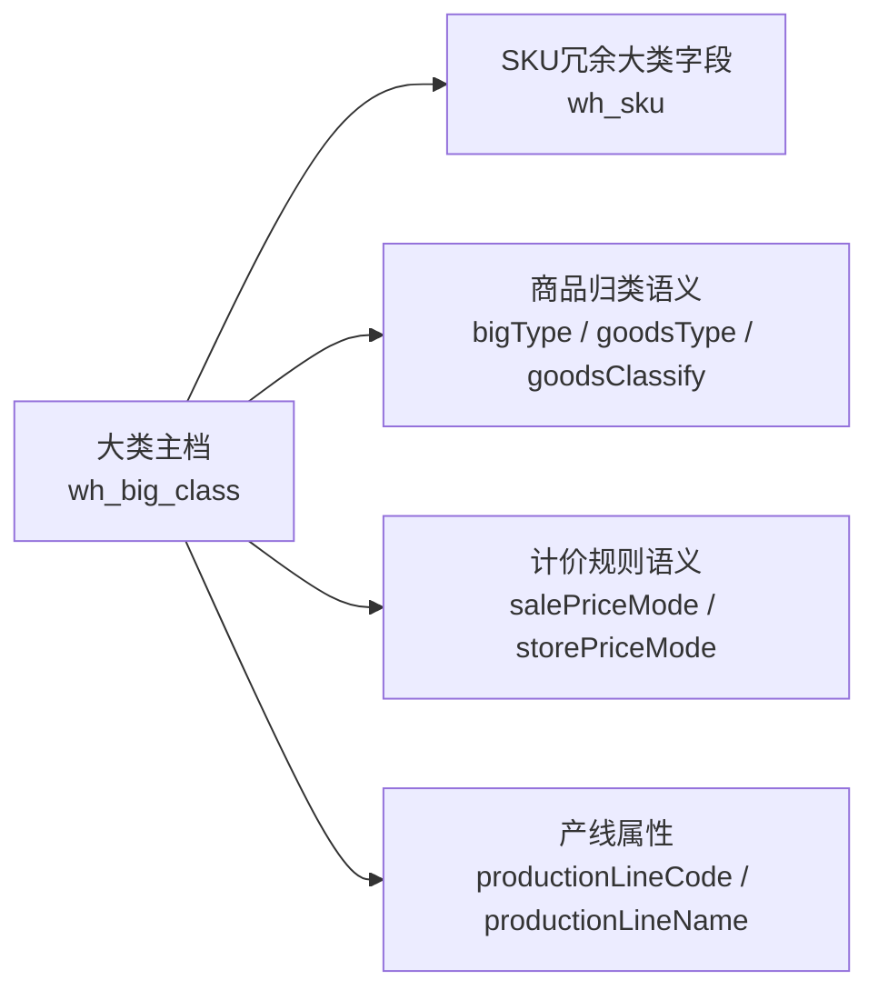

# 大类档案实体链路图

```mermaid
flowchart LR
    A["大类主档<br/>wh_big_class"] --> B["SKU冗余大类字段<br/>wh_sku"]
    A --> C["商品归类语义<br/>bigType / goodsType / goodsClassify"]
    A --> D["计价规则语义<br/>salePriceMode / storePriceMode"]
    A --> E["产线属性<br/>productionLineCode / productionLineName"]
```
