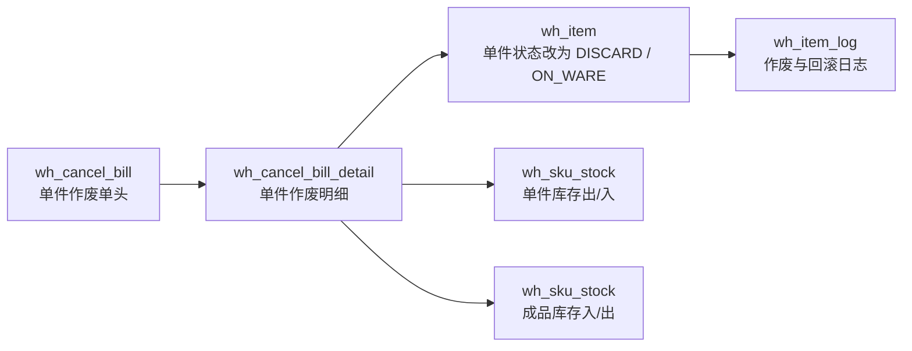

# 单件作废单实体图

```mermaid
flowchart LR
    A["wh_cancel_bill\n单件作废单头"] --> B["wh_cancel_bill_detail\n单件作废明细"]
    B --> C["wh_item\n单件状态改为 DISCARD / ON_WARE"]
    C --> D["wh_item_log\n作废与回滚日志"]
    B --> E["wh_sku_stock\n单件库存出/入"]
    B --> F["wh_sku_stock\n成品库存入/出"]
```

## 说明
1. 单件作废单不会删除 `wh_item`，而是切换单件状态。
2. 库存侧是两条反向链：审核时“单件出、成品入”，反审时“成品出、单件入”。
3. 这条链和单件入库、单件调整共同构成单件生命周期闭环。
