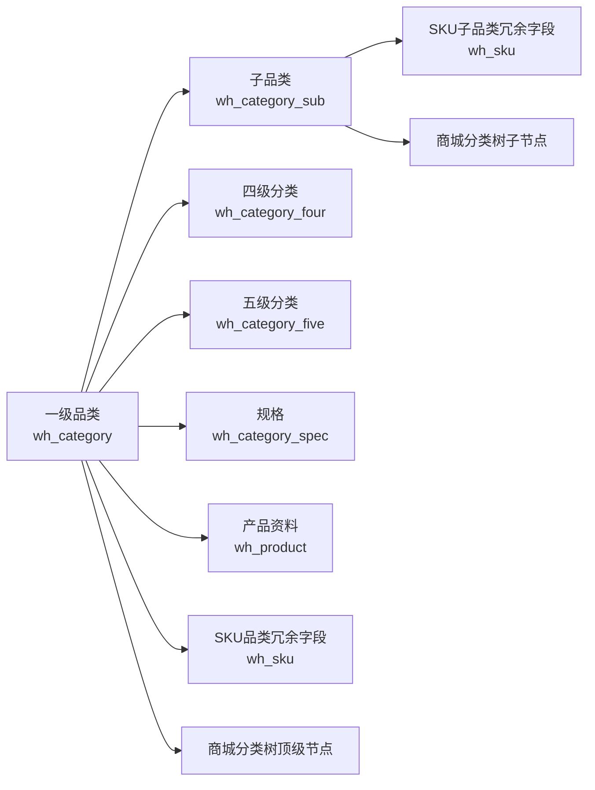

# 品类结构实体链路图

```mermaid
flowchart LR
    A["一级品类<br/>wh_category"] --> B["子品类<br/>wh_category_sub"]
    A --> C["四级分类<br/>wh_category_four"]
    A --> D["五级分类<br/>wh_category_five"]
    A --> E["规格<br/>wh_category_spec"]
    A --> F["产品资料<br/>wh_product"]
    A --> G["SKU品类冗余字段<br/>wh_sku"]
    B --> H["SKU子品类冗余字段<br/>wh_sku"]
    A --> I["商城分类树顶级节点"]
    B --> J["商城分类树子节点"]
```
