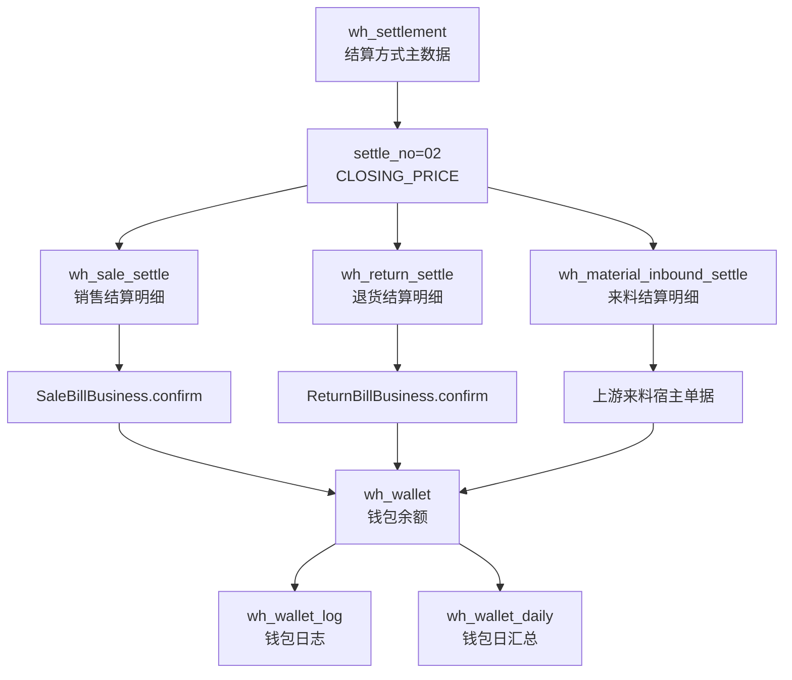

# 结价单实体关系图
> 核心关注：结价如何作为结算明细分支嵌入宿主业务，并在钱包侧形成反向冲回

```mermaid
graph TD
    A["wh_settlement\n结算方式主数据"] --> B["settle_no=02\nCLOSING_PRICE"]
    B --> C["wh_sale_settle\n销售结算明细"]
    B --> D["wh_return_settle\n退货结算明细"]
    B --> E["wh_material_inbound_settle\n来料结算明细"]

    C --> F["SaleBillBusiness.confirm"]
    D --> G["ReturnBillBusiness.confirm"]
    E --> H["上游来料宿主单据"]

    F --> I["wh_wallet\n钱包余额"]
    G --> I
    H --> I

    I --> J["wh_wallet_log\n钱包日志"]
    I --> K["wh_wallet_daily\n钱包日汇总"]
```

## 关系说明
- `wh_settlement` 只定义“02=结价”这种结算方式，不负责业务过账。
- 真正承载结价数据的是各宿主单据的结算明细表。
- 真正让结价生效的是宿主单据审核逻辑里的“主账 + 结价反向冲回”双动作。
