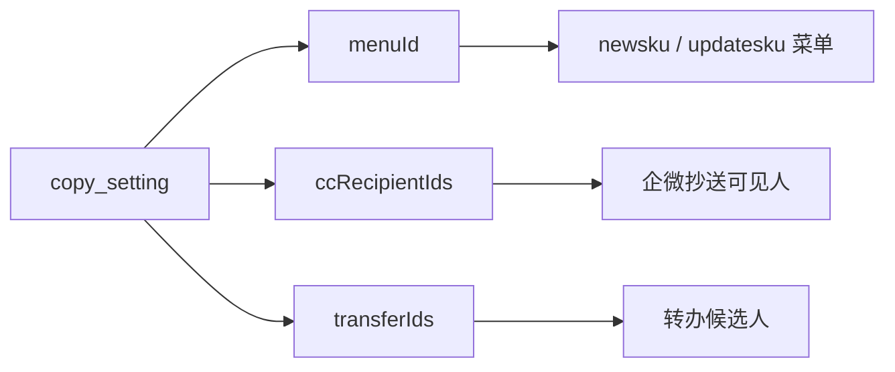

# 抄送配置实体链路

```mermaid
flowchart LR
    A["copy_setting"] --> B["menuId"]
    A --> C["ccRecipientIds"]
    A --> D["transferIds"]
    B --> E["newsku / updatesku 菜单"]
    C --> F["企微抄送可见人"]
    D --> G["转办候选人"]
```
