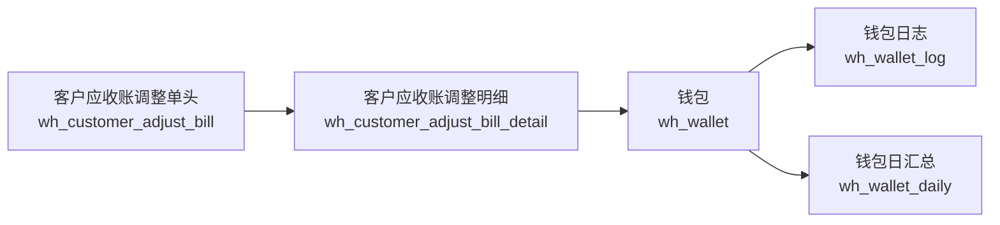

# 客户应收账调整钱包链实体图
> 基于 commit: `48af575a1314636c88e9f05ca3cb4443f88865bd`，日期：2026-03-31

## 适用范围
- 客户应收账调整审核/反审时对客户钱包的逐条回写。
- 同时覆盖金额调整和金重调整两种口径。

## Mermaid

## 关键关系
| 来源 | 目标 | 关系 |
|------|------|------|
| `wh_customer_adjust_bill` | `wh_customer_adjust_bill_detail` | 一对多，单头只承载日期、网点、返利、状态等头信息 |
| `wh_customer_adjust_bill_detail.customer_id` | `customer.account_id -> wh_wallet.account_id` | 明细先找客户，再映射到账户钱包 |
| `wh_customer_adjust_bill_detail.material_id` | `material.material_no -> wh_wallet.material_no` | 金重调整按材质钱包落账 |
| `wh_customer_adjust_bill_detail.amount` | `CASH 钱包` | 金额调整始终走现金钱包 |

## 关键回写字段
| 目标表 | 字段 | 来源动作 |
|------|------|------|
| `wh_wallet` | `balance` | `confirm/unConfirm` |
| `wh_wallet_log` | `balanceBefore/balanceDiff/balanceAfter/bizNo/billStatus/accountingType` | `confirm/unConfirm` |
| `wh_wallet_daily` | `balance` | `confirm/unConfirm` |

## 关键说明
1. 金额调整固定走现金钱包：`walletTypeNo = CASH`，`settleClass = SETTLE_CASH`。
2. 金重调整按明细材质、钱包类型、结算类别落到非现金钱包。
3. `createWalletByAccountNew()` 不是只记日志，而是同时改钱包余额、刷新日汇总、再写日志。
