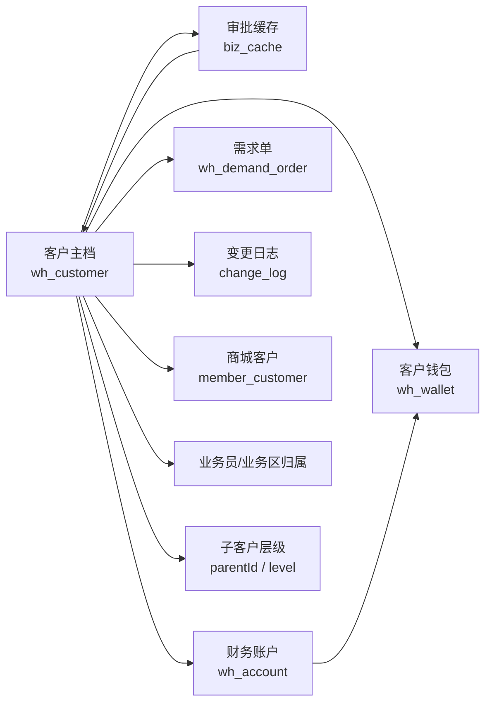

# 客户档案实体链路图

```mermaid
flowchart LR
    A["客户主档<br/>wh_customer"] --> B["审批缓存<br/>biz_cache"]
    A --> C["财务账户<br/>wh_account"]
    A --> D["客户钱包<br/>wh_wallet"]
    A --> E["需求单<br/>wh_demand_order"]
    A --> F["变更日志<br/>change_log"]
    A --> G["商城客户<br/>member_customer"]
    A --> H["业务员/业务区归属"]

    B --> A
    C --> D
    A --> I["子客户层级<br/>parentId / level"]
```
