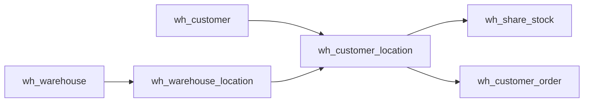

# 客户共享库位实体链

```mermaid
flowchart LR
    CUSTOMER["wh_customer"] --> CLOCAL["wh_customer_location"]
    LOCAL["wh_warehouse_location"] --> CLOCAL
    WARE["wh_warehouse"] --> LOCAL
    CLOCAL --> SHARE["wh_share_stock"]
    CLOCAL --> ORDER["wh_customer_order"]
```
