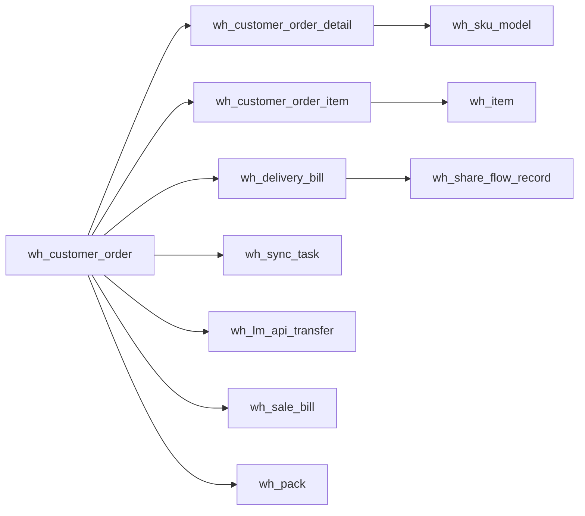

# 客户订单实体链

```mermaid
flowchart LR
    ORDER["wh_customer_order"] --> DETAIL["wh_customer_order_detail"]
    ORDER --> ITEM["wh_customer_order_item"]
    ORDER --> DELIVERY["wh_delivery_bill"]
    ORDER --> SYNC["wh_sync_task"]
    ORDER --> API["wh_lm_api_transfer"]
    ORDER --> SALE["wh_sale_bill"]
    ORDER --> PACK["wh_pack"]
    DELIVERY --> FLOW["wh_share_flow_record"]
    ITEM --> ITEM_ENTITY["wh_item"]
    DETAIL --> MODEL["wh_sku_model"]
```
