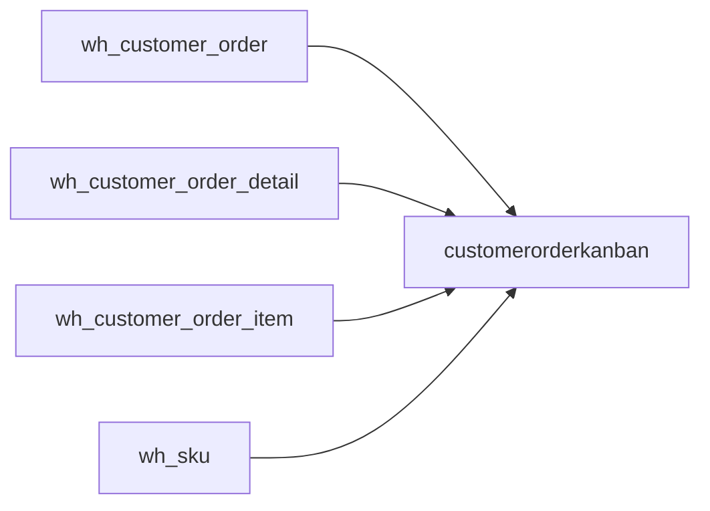

# 客户订单看板实体链

```mermaid
flowchart LR
    ORDER["wh_customer_order"] --> KANBAN["customerorderkanban"]
    DETAIL["wh_customer_order_detail"] --> KANBAN
    ITEM["wh_customer_order_item"] --> KANBAN
    SKU["wh_sku"] --> KANBAN
```
