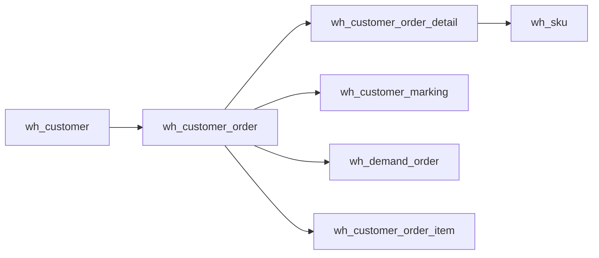

# 客户订单接单实体链

```mermaid
flowchart LR
    CUSTOMER["wh_customer"] --> ORDER["wh_customer_order"]
    ORDER --> DETAIL["wh_customer_order_detail"]
    ORDER --> MARKING["wh_customer_marking"]
    ORDER --> DEMAND["wh_demand_order"]
    ORDER --> ITEM["wh_customer_order_item"]
    DETAIL --> SKU["wh_sku"]
```
