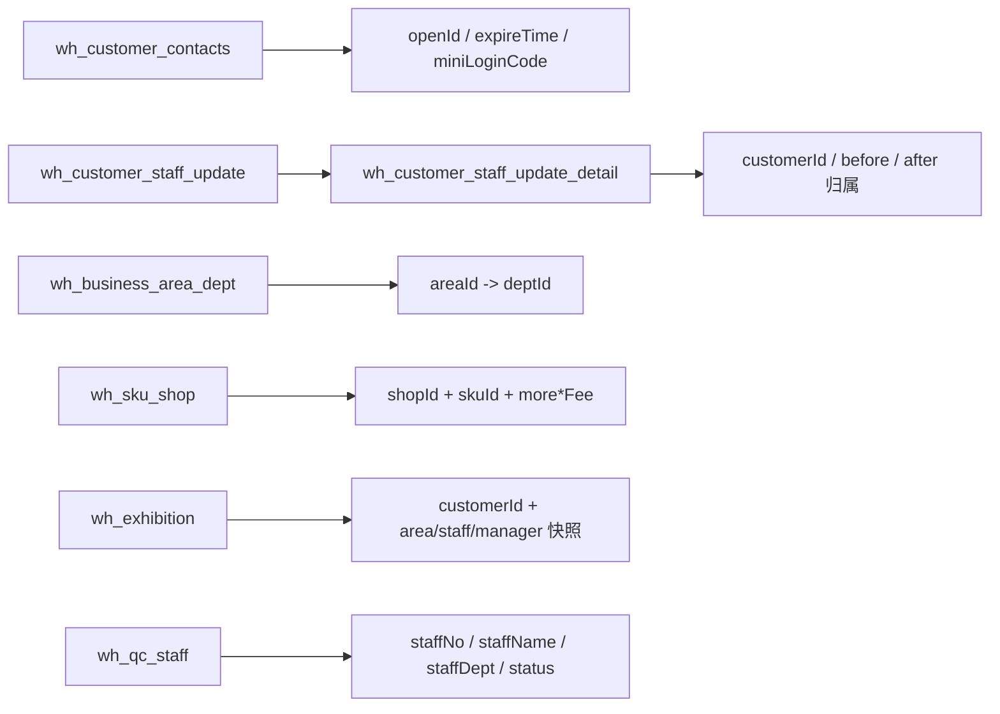

# 客户与组织尾项实体关系图

```mermaid
flowchart LR
    A["wh_customer_contacts"] --> A1["openId / expireTime / miniLoginCode"]
    B["wh_customer_staff_update"] --> C["wh_customer_staff_update_detail"]
    C --> C1["customerId / before / after 归属"]
    D["wh_business_area_dept"] --> D1["areaId -> deptId"]
    E["wh_sku_shop"] --> E1["shopId + skuId + more*Fee"]
    F["wh_exhibition"] --> F1["customerId + area/staff/manager 快照"]
    G["wh_qc_staff"] --> G1["staffNo / staffName / staffDept / status"]
```
