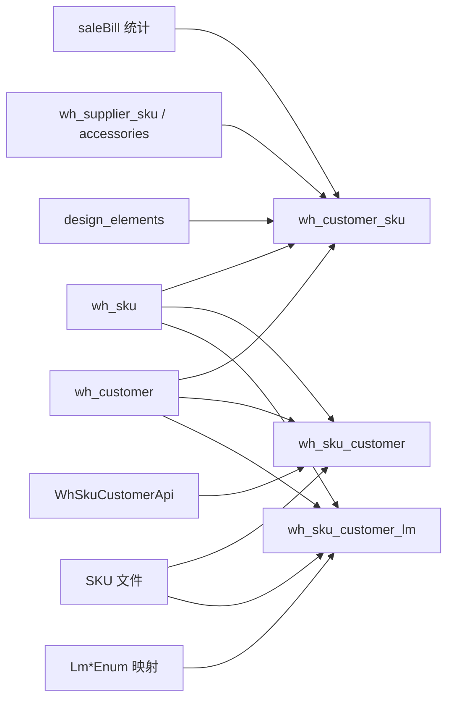

# 客户侧 SKU 关系域实体链

```mermaid
flowchart LR
    SKU["wh_sku"] --> CS["wh_customer_sku"]
    CUST["wh_customer"] --> CS
    SALE["saleBill 统计"] --> CS
    BOM["wh_supplier_sku / accessories"] --> CS
    DE["design_elements"] --> CS

    SKU --> SC["wh_sku_customer"]
    CUST --> SC
    FILE["SKU 文件"] --> SC
    API["WhSkuCustomerApi"] --> SC

    SKU --> LM["wh_sku_customer_lm"]
    CUST --> LM
    FILE --> LM
    ENUM["Lm*Enum 映射"] --> LM
```
