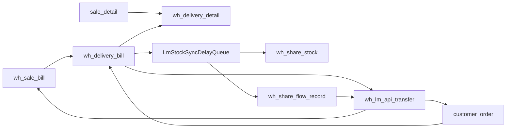

# 出货单实体链

```mermaid
flowchart LR
    SALE["wh_sale_bill"] --> DELIVERY["wh_delivery_bill"]
    SALE_DETAIL["sale_detail"] --> DELIVERY_DETAIL["wh_delivery_detail"]
    DELIVERY --> DELIVERY_DETAIL
    ORDER["customer_order"] --> DELIVERY
    DELIVERY --> API["wh_lm_api_transfer"]
    API --> ORDER
    API --> SALE
    DELIVERY --> QUEUE["LmStockSyncDelayQueue"]
    QUEUE --> SHARE["wh_share_stock"]
    QUEUE --> FLOW["wh_share_flow_record"]
    FLOW --> API
```
