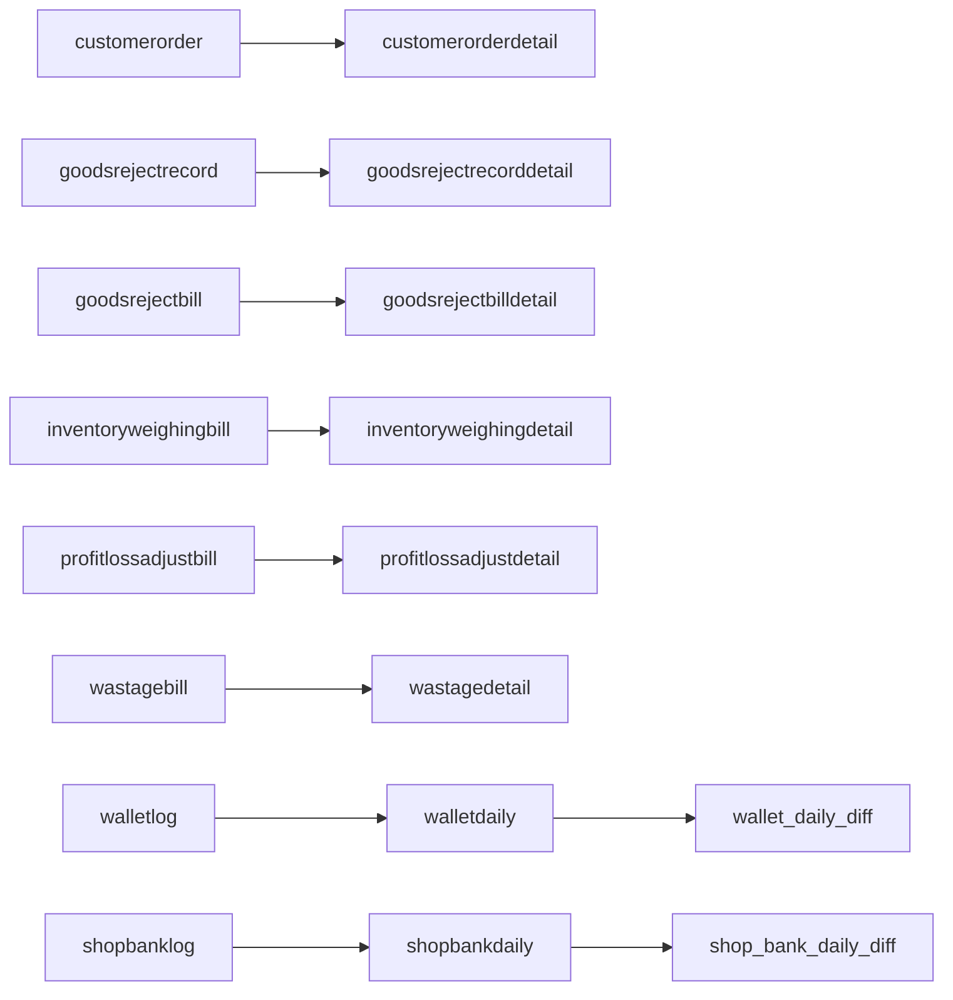

# 明细事实层与资金日结实体链路图

```mermaid
flowchart LR
    A["customerorder"] --> B["customerorderdetail"]
    C["goodsrejectrecord"] --> D["goodsrejectrecorddetail"]
    E["goodsrejectbill"] --> F["goodsrejectbilldetail"]
    G["inventoryweighingbill"] --> H["inventoryweighingdetail"]
    I["profitlossadjustbill"] --> J["profitlossadjustdetail"]
    K["wastagebill"] --> L["wastagedetail"]
    M["walletlog"] --> N["walletdaily"] --> O["wallet_daily_diff"]
    P["shopbanklog"] --> Q["shopbankdaily"] --> R["shop_bank_daily_diff"]
```
