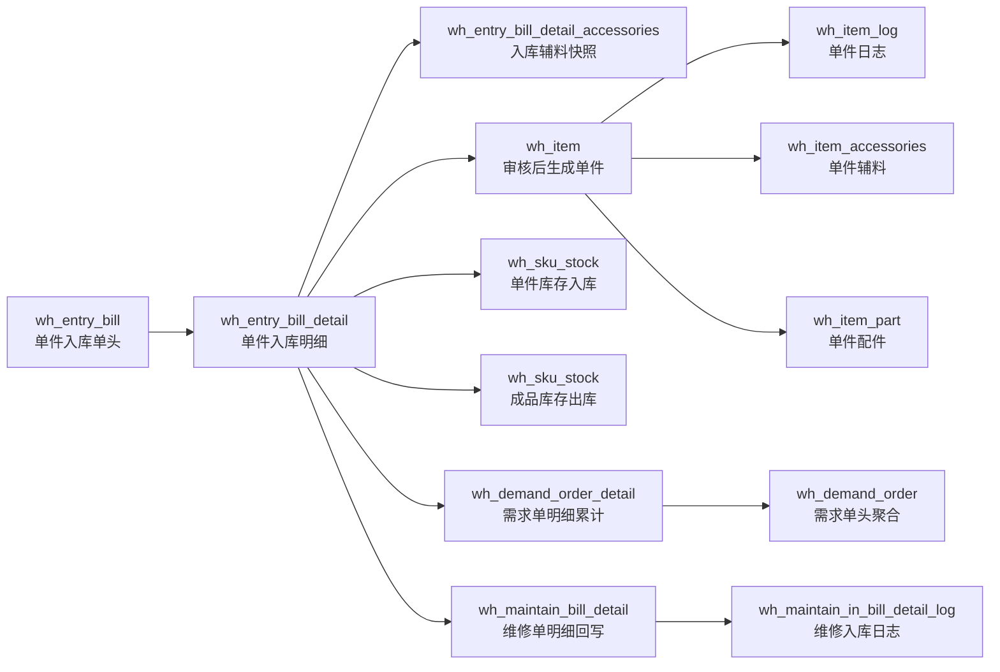

# 单件入库单实体图

```mermaid
flowchart LR
    A["wh_entry_bill\n单件入库单头"] --> B["wh_entry_bill_detail\n单件入库明细"]
    B --> C["wh_entry_bill_detail_accessories\n入库辅料快照"]
    B --> D["wh_item\n审核后生成单件"]
    D --> E["wh_item_log\n单件日志"]
    D --> F["wh_item_accessories\n单件辅料"]
    D --> G["wh_item_part\n单件配件"]
    B --> H["wh_sku_stock\n单件库存入库"]
    B --> I["wh_sku_stock\n成品库存出库"]
    B --> J["wh_demand_order_detail\n需求单明细累计"]
    J --> K["wh_demand_order\n需求单头聚合"]
    B --> L["wh_maintain_bill_detail\n维修单明细回写"]
    L --> M["wh_maintain_in_bill_detail_log\n维修入库日志"]
```

## 说明
1. 单件入库单审核时会同时写“单件表 + 单件日志 + 库存 + 需求单 + 维修单”。
2. `wh_sku_stock` 在这里承担两种方向相反的动作：单件库存增加、成品库存减少。
3. 反审时 `wh_item` 会被物理删除，但 `wh_item_log` 仍保留回滚痕迹。
