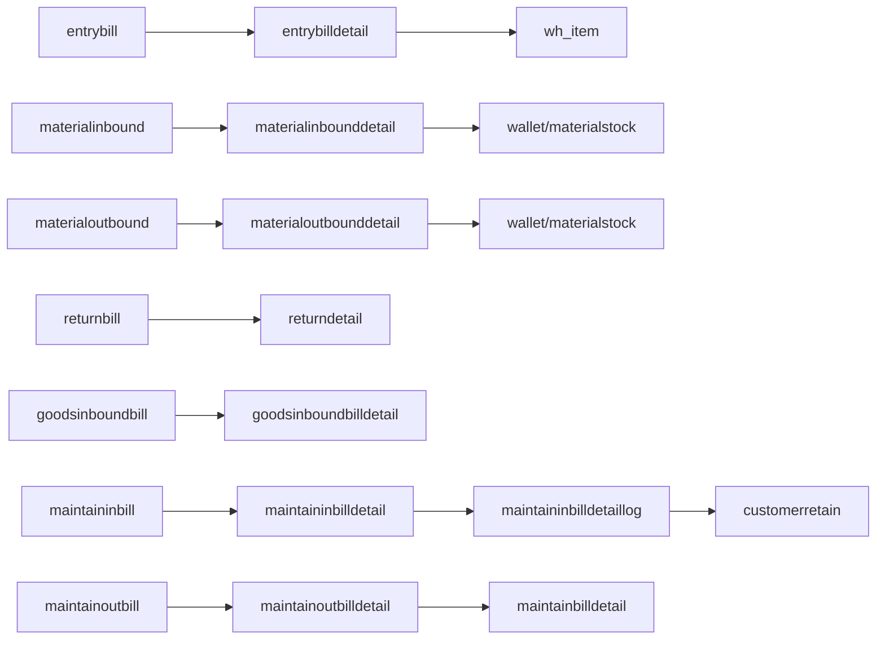

# 执行明细与日志实体链路图

```mermaid
flowchart LR
    A["entrybill"] --> B["entrybilldetail"]
    B --> C["wh_item"]

    D["materialinbound"] --> E["materialinbounddetail"]
    E --> F["wallet/materialstock"]

    G["materialoutbound"] --> H["materialoutbounddetail"]
    H --> I["wallet/materialstock"]

    J["returnbill"] --> K["returndetail"]

    L["goodsinboundbill"] --> M["goodsinboundbilldetail"]

    N["maintaininbill"] --> O["maintaininbilldetail"]
    O --> P["maintaininbilldetaillog"]
    P --> Q["customerretain"]

    R["maintainoutbill"] --> S["maintainoutbilldetail"]
    S --> T["maintainbilldetail"]
```
