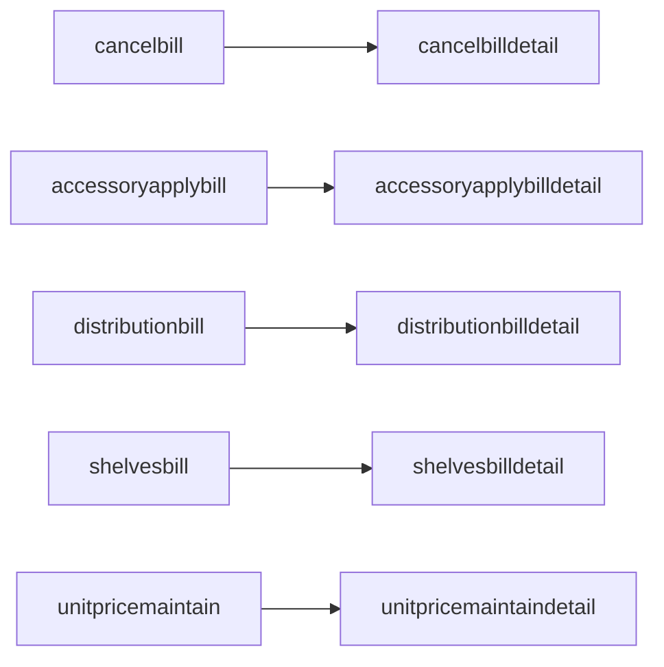

# 执行尾项明细实体链路图

```mermaid
flowchart LR
    A["cancelbill"] --> B["cancelbilldetail"]
    C["accessoryapplybill"] --> D["accessoryapplybilldetail"]
    E["distributionbill"] --> F["distributionbilldetail"]
    G["shelvesbill"] --> H["shelvesbilldetail"]
    I["unitpricemaintain"] --> J["unitpricemaintaindetail"]
```
