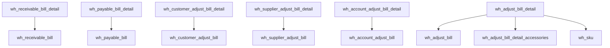

# 财务明细卫星实体图

```mermaid
flowchart TD
    A["wh_receivable_bill_detail"] --> B["wh_receivable_bill"]
    C["wh_payable_bill_detail"] --> D["wh_payable_bill"]
    E["wh_customer_adjust_bill_detail"] --> F["wh_customer_adjust_bill"]
    G["wh_supplier_adjust_bill_detail"] --> H["wh_supplier_adjust_bill"]
    I["wh_account_adjust_bill_detail"] --> J["wh_account_adjust_bill"]
    K["wh_adjust_bill_detail"] --> L["wh_adjust_bill"]
    K --> M["wh_adjust_bill_detail_accessories"]
    K --> N["wh_sku"]
```
