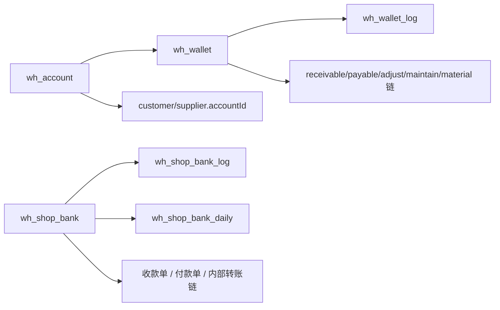

# 资金主数据实体链

```mermaid
flowchart LR
    A["wh_account"] --> B["wh_wallet"]
    B --> C["wh_wallet_log"]
    D["wh_shop_bank"] --> E["wh_shop_bank_log"]
    D --> F["wh_shop_bank_daily"]
    A --> G["customer/supplier.accountId"]
    B --> H["receivable/payable/adjust/maintain/material 链"]
    D --> I["收款单 / 付款单 / 内部转账链"]
```
