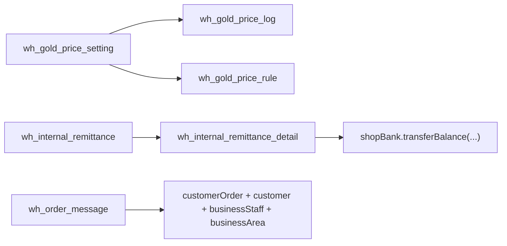

# 资金与消息尾项实体图

```mermaid
flowchart LR
    A["wh_gold_price_setting"] --> B["wh_gold_price_log"]
    A --> C["wh_gold_price_rule"]
    D["wh_internal_remittance"] --> E["wh_internal_remittance_detail"]
    E --> F["shopBank.transferBalance(...)"]
    G["wh_order_message"] --> H["customerOrder + customer + businessStaff + businessArea"]
```
